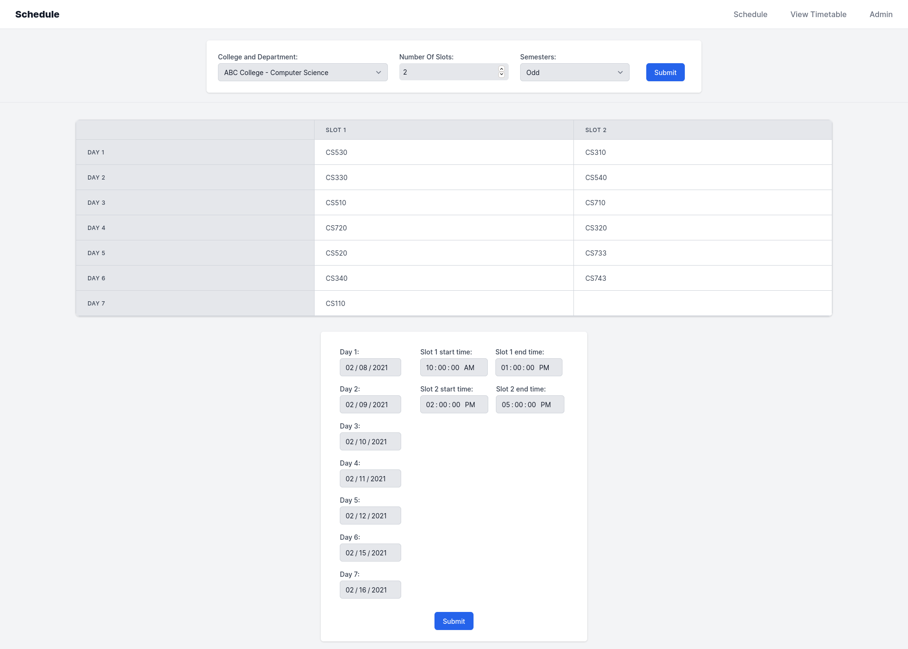
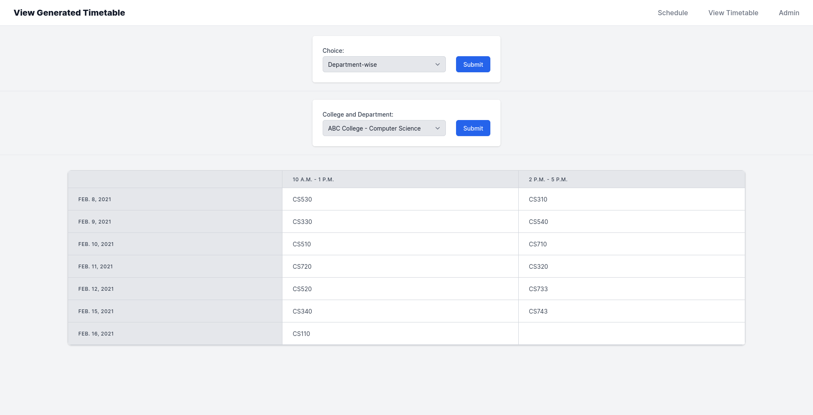
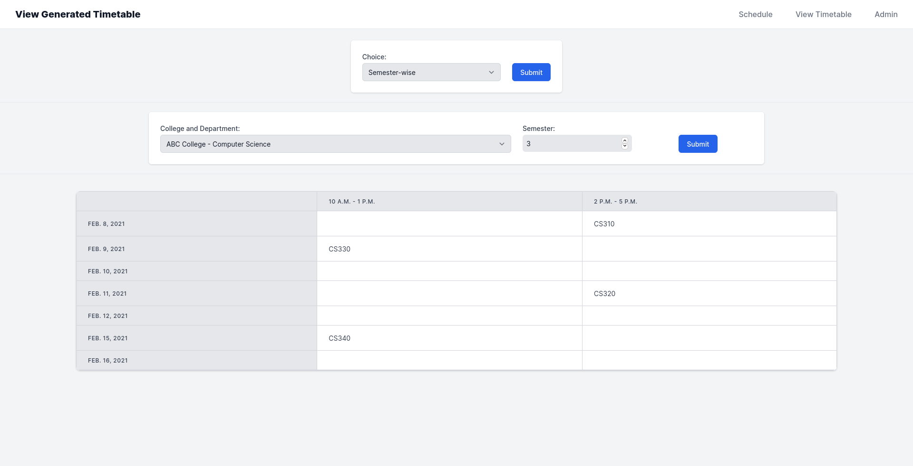
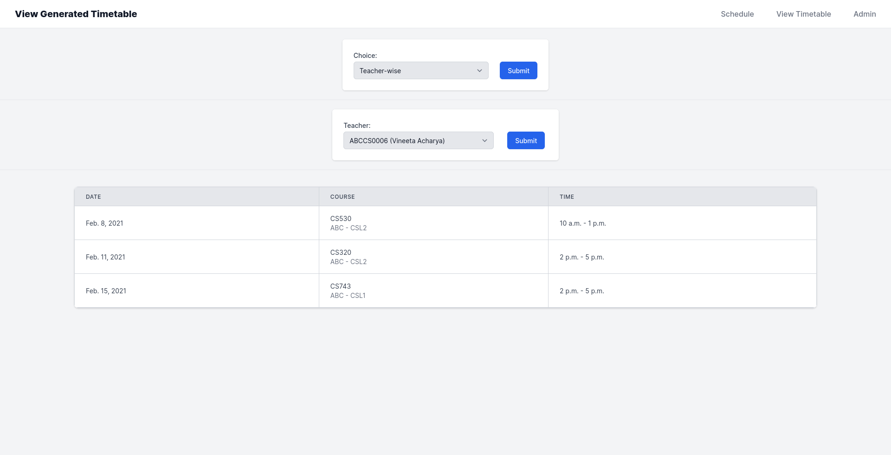
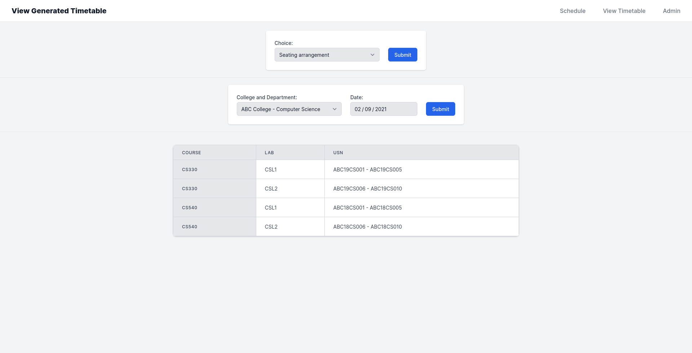

= University Practical Exam Scheduling System
Sanchith Hegde; Prajith V Nair
:toc: preamble
:figure-caption!:

University practical examination scheduling system, as an academic project, implemented in Python.

== Installation

The following instructions are primarily aimed at Linux systems.
You will have to make necessary changes to the commands to be able to run them on other operating systems.

=== Prerequisites

You will need to have Python, https://pipenv.pypa.io/en/latest/install/#installing-pipenv[pipenv], https://yarnpkg.com/getting-started/install[yarn] and https://www.postgresql.org/download/[PostgreSQL] installed before proceeding further.
Optionally, you can also install https://direnv.net/docs/installation.html[direnv] to automatically load environment variables and activate the Python environment when you switch to the project directory.

Clone the repository and switch to the project directory.

[source, shell]
--
$ git clone https://github.com/SanchithHegde/university-practical-exam/
$ cd university-practical-exam
--

=== Installing Dependencies

* Install Python dependencies.
+
[source, shell]
--
$ pipenv install
--

* Install JavaScript dependencies.
+
[source, shell]
--
$ cd js_toolchain
$ yarn install
$ cd ..
--

=== Database Setup

* Ensure that the database cluster has been initialized.
If not, initialize the database cluster following the instructions https://www.postgresql.org/docs/current/creating-cluster.html[here].
+
Alternatively, if you prefer to have a separate data directory for each project, follow the instructions on https://jamey.thesharps.us/2019/05/29/per-project-postgres[this post].

* Create a database user and the database by connecting to the `psql` shell.
+
[source, sql]
--
CREATE ROLE db_user WITH NOSUPERUSER CREATEDB LOGIN PASSWORD 'db_password';
CREATE DATABASE db_name;
\q
--

=== Environment Variables

The following environment variables need to be set for the application to run:

* `DATABASE_NAME`: The name of the database used by the application.
* `DATABASE_USER`: The username of the database user used while connecting.
* `DATABASE_PASSWORD`: The password of the database user used while connecting.
* `DATABASE_HOST`: The database host. When running locally, this can be set to either an empty string (`""`) or `localhost`.
* `DATABASE_PORT`: Port used while connecting. When running locally, this can be set to either an empty string (`""`) to specify the default port.
* `SECRET_KEY`: Secret key used by Django.
+
You can generate one by running the following command:
+
[source, shell]
--
$ python3 -c 'from django.core.management import utils; print(utils.get_random_secret_key())'
m2)qp1lqgd7)30e-k-1=l8tol9%!z&g1rug*ka7hpqtw=cnw8&
--
+
[WARNING]
====
Do **NOT** use the secret key provided here as an example.
Generate one by running the above command on your system.
====

Then the above mentioned environment variables can be set in the following fashion:

[source, shell]
--
export DATABASE_NAME="db_name"
export DATABASE_USER="db_user"
export DATABASE_PASSWORD="db_password"
export DATABASE_HOST=""
export DATABASE_PORT=""
export SECRET_KEY="m2)qp1lqgd7)30e-k-1=l8tol9%!z&g1rug*ka7hpqtw=cnw8&"
--

Alternatively, loading the Python virtual environment and setting the environment variables can be automated with `direnv`.
A sample `.envrc` file has been included as `.envrc.sample`.
Make necessary changes to the file and rename it to `.envrc` for `direnv` to track the file.

=== Database Migrations

Run Django migrations by running the following command in the `practical_exam` directory:

[source, shell]
--
python3 manage.py migrate
--

=== Create a Django Super User

The super user can be used to access the Django admin interface and modify entries in the database.
Create a super user by running the following command in the `practical_exam` directory and answer the prompts that follow:

[source, shell]
--
python3 manage.py createsuperuser
--

== Running the Application

* Switch to the `practical_exam` directory.
+
[source, shell]
--
cd practical_exam
--

* Start the Django server.
+
[source, shell]
--
python3 manage.py runserver
--

* Visit `http://127.0.0.1:8000/admin` in your browser to enter/modify data in the database.
* Visit `http://127.0.0.1:8000/` to view the application.

== Screenshots

.Scheduled Courses

.Department-wise Timetable

.Semester-wise Timetable

.Teacher-wise Timetable

.Seating Arrangement

== Licensing

Dual licensed under Apache 2.0 or MIT at your option.
